# EPAM Homework: AWS

[AWS task](TaskAWS_updated_links.pdf)

## Task

- [EC2](#ec2)
- [EBS](#ebs)
- [Lightsail](#lightsail)
- [S3](#s3)
- [ECS](#ecs)
- [Lambda](#lambda)
- [Static Website](#static-website)


## EC2 <a name="ec2"></a>

### Launch EC2 instance

Configuration process of launching __ec2 instance__ is pretty straight forward so I'll attach screenshot of launched instance. Basicly we nned to be sure that after launch instance is in __running__ state and all __status checks__ have passed.

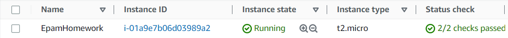

Snapshot of a running instance.

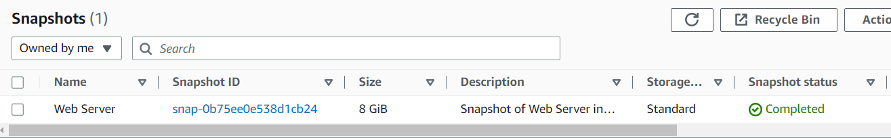

### Connect to EC2 instance

In this step I use created earlier key pair to connect to instance via __ssh__. We need to be sure __Security Group__ does accept __ssh__ connection.

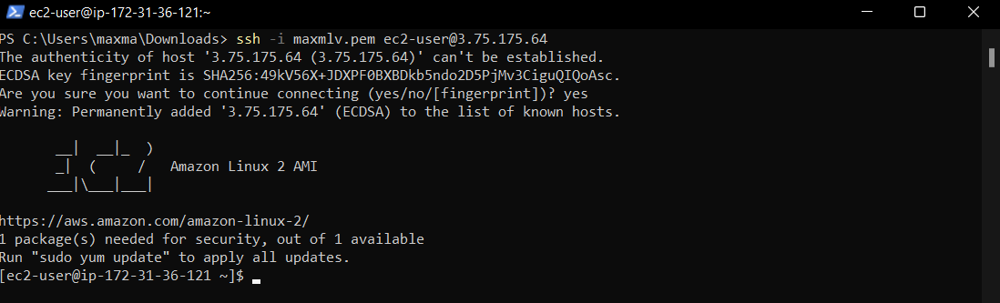

### Terminate EC2 instance

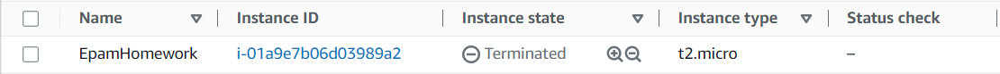

## EBS <a name="ebs"></a>

Created new volume Disk_D

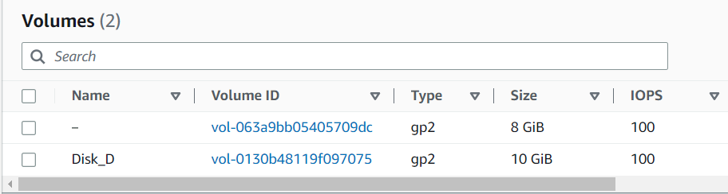

Attach Disk_D volume to running EC2 instance Web Server.

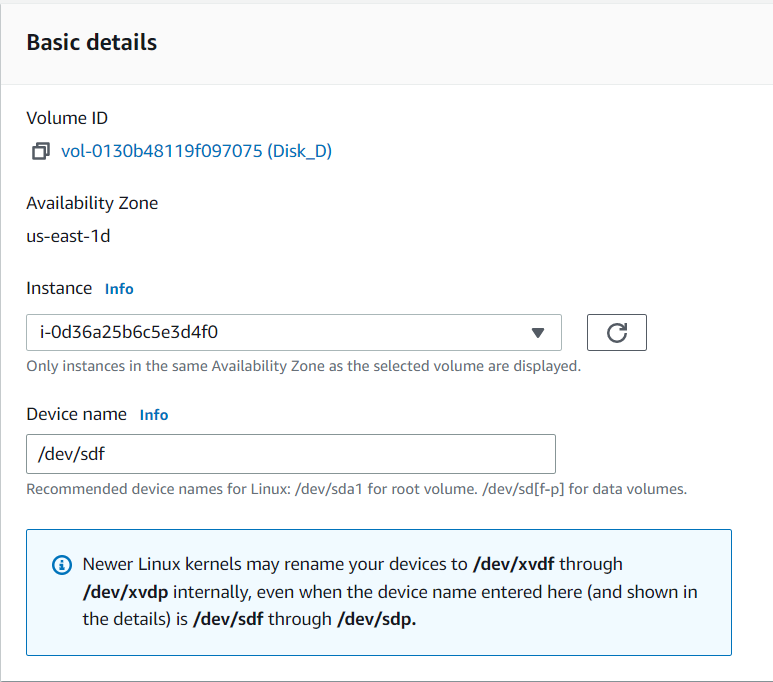

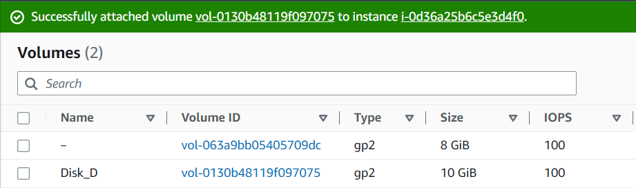

After we attached new volume Disk_D to EC2 instance, we need to create a file system on this volume and mount it to the directory.

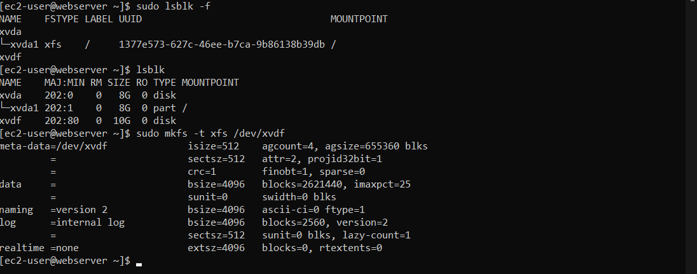

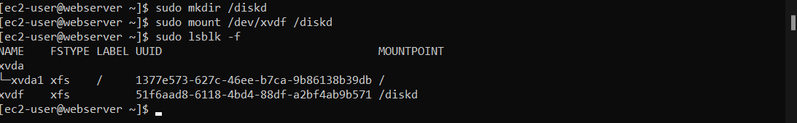

Now we can create some data that we need to store on volume Disk_D.

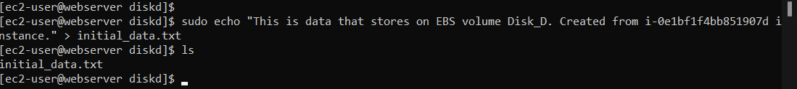

To launch new instance from EBS volume snapshot we need to create image from snapshot.

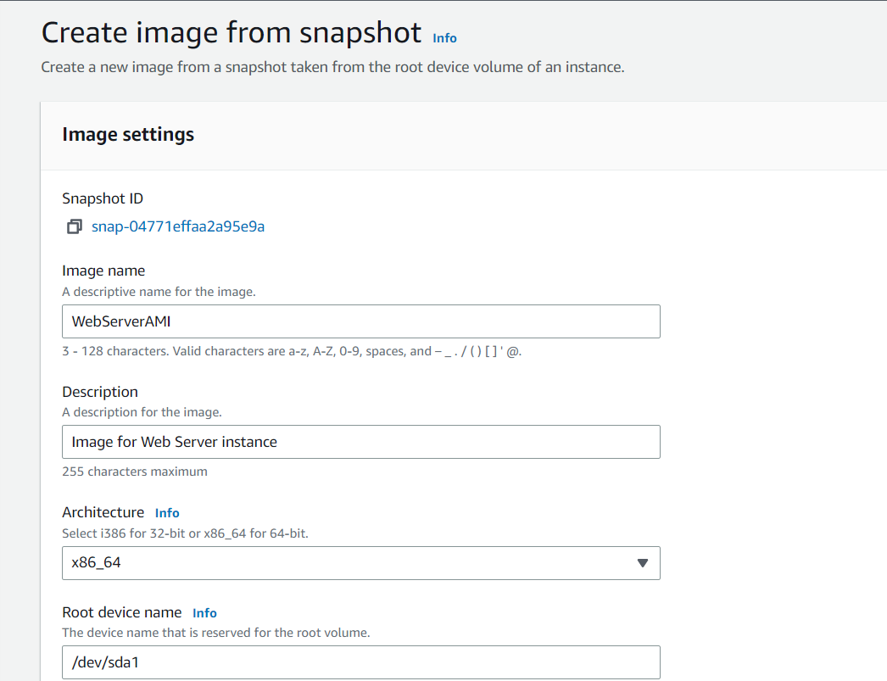

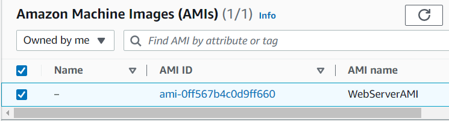

Using this AMI we can launch our instance.

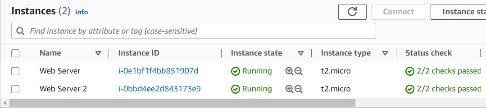

Now we can detach Disk_D volume from Web Server and attach it to Web Server 2 and mount it to diskd directory.

> To check if the EBS volume has mounted proparly I use ```lsblk -f``` to see if the volume has the desired mountpoint.

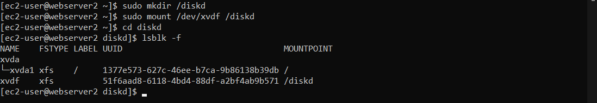

## Lightsail <a name="lightsail"></a>

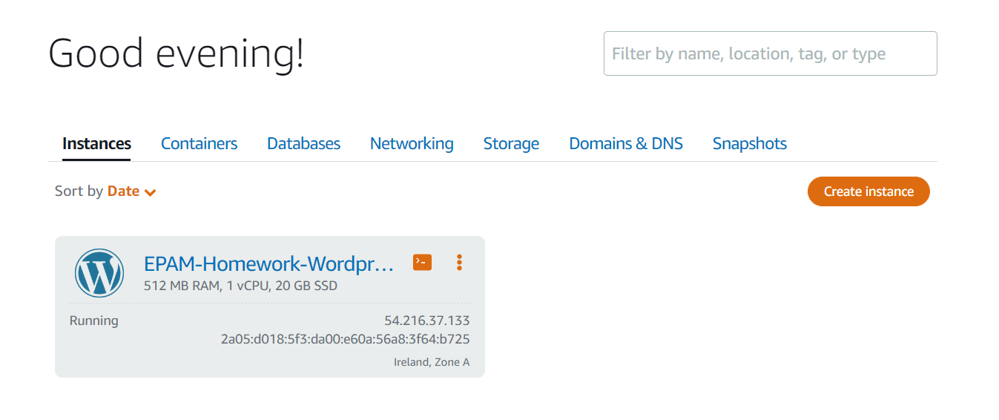

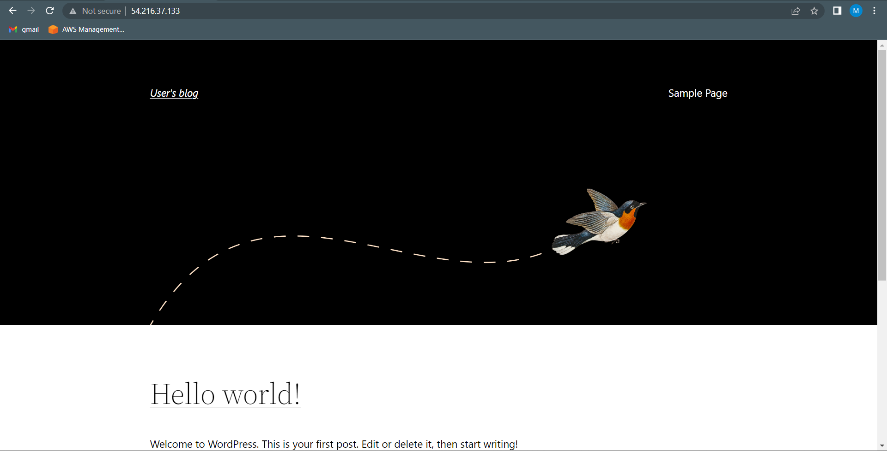

## S3 <a name="s3"></a>

First we need to create S3 bucket where objects will be stored.

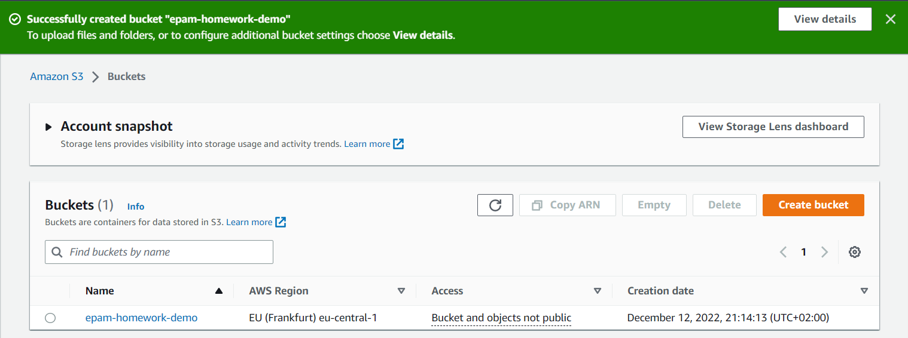

After we created S3 bucket we can upload objects.

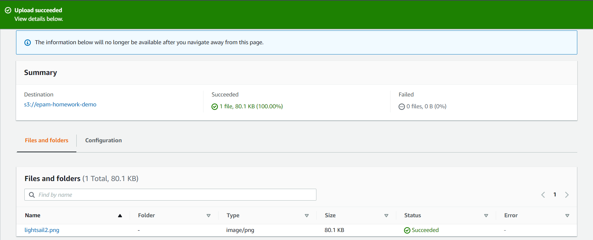

To retrieve objects we need to choose desired and download it.

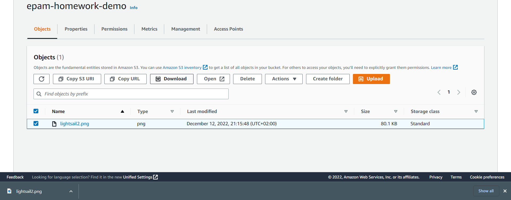

## ECS <a name="ecs"></a>

## Lambda <a name="lambda"></a>

## Static website <a name="static_website"></a>