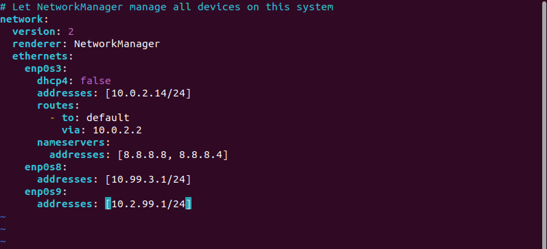

# EPAM Homework: Networking


## Subnets:
- Net1 - 192.168.3.0/24
- Net2 - 10.99.3.0/24
- Net3 - 10.2.99.0/24
- Net4 - 172.16.3.0/24

---
## Task

1. Configure static IP addresses on all network interfaces for Server-1.

As you might see, __Server-1__ is running on Ubuntu. This is give a way to configure settings for network interfaces with __netplan__ starting with __Ubuntu 17.10 Artful__.

__/etc/netplan/*.yaml__



>Unfortunately I don't have an opportunity to configure static routes on my Wi-Fi router, I already changed __Briged Network__ to __NAT__ and setted up __NAT__ service on __Server-1__ for __Client-1__ and __Client-2__ machines. (Step 8 of this task)
 
After interfaces have been configured changes to interfaces in __netplan__ YAML file, we can apply changes with:

```
sudo netplan apply
```

This is will also restart network service.

2. Set up DHCP server on Server-1 which will configure IP addresses Int1 for Client-1 and Client-2.

__/etc/dhcp/dhcpd.conf__


__/etc/default/isc-dhcp-server__


__Client-1__


__Client-2__


3. With __ping__ and __traceroute__ commands check the connection between virtual machines.

__Server-1__


__Client-1__


__Client-2__


4. Initialize two IP addresses __172.17.D+10.1/24__ and __172.17.D+20.1/24__ to __lo__ interface on __Client-1__. Configure routing on __Client-2__ machine that way: 

__Client-2 -> Server-1 -> 172.17.D+10.1__

__Client-2 -> Net4 -> 172.17.D+20.1__

First of all I added addresses to __lo__ interface.


### Configuration of routing from __Client-2__ to __172.17.D+10.1/24__

Adding route from __Client-2__ to __Server-1__:


From __Server-1__ adding route for __172.17.13.0/24__ to __Client-1__:


Test connection and check traceroute from __Client-2__:


### Configuration of routing from __Client-2__ to __172.17.D+20.1/24__

Adding route from __Client-2__ to __Client-1__ via __Net4__ network:


Test connection:


5. Calculate summarizing for networks __172.17.13.0/24__ and __172.17.23.0/24__. Configure routing for summarized network via __Server-1__.

Summarizing:


Replacing old IP addresses in __lo__ interface with new in summarized network:


Configuring route for to summarized network __172.17.0.0/19__ via __Server-1__

__Client-2 route__


__Server-1 route__


Check connection with ping and traceroute from __Client-2__ to __172.17.0.0/19__ network:

